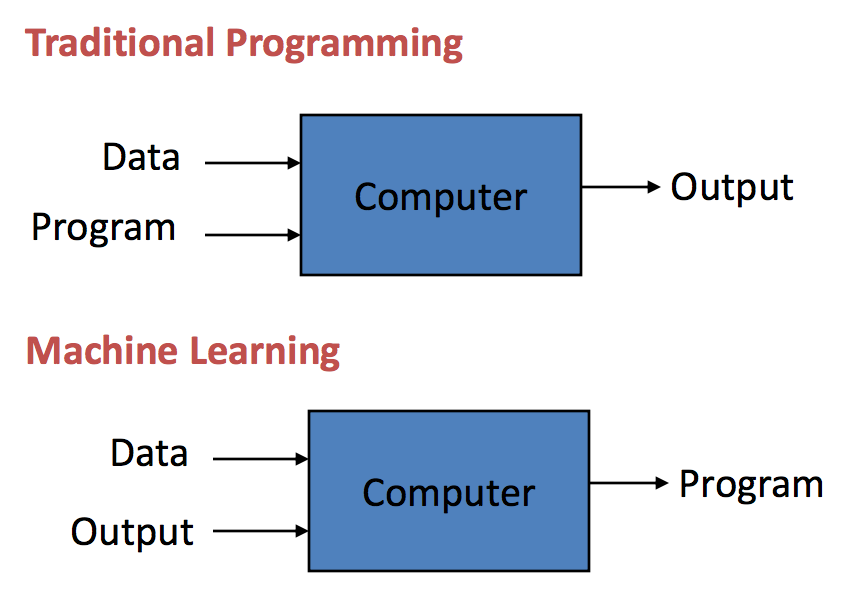
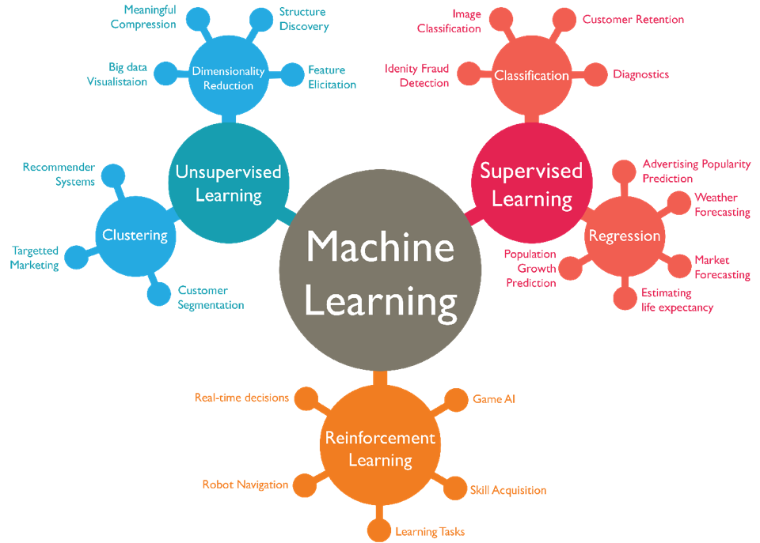
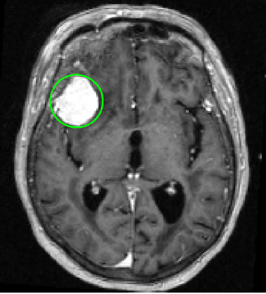

Introduction to Machine Learning
==================================

Defining Machine Learning
-------------------------

**Machine Learning** utilizes mathematics, statistics, and computer science to shape and analyze data as to make predictions and/or decisions.

*Traditional programming* has explicit methods that are manually created to produce output whereas *machine learning* is where the computer learns its own methods based on input and output data.

*“Machine Learning is the field of study that gives computers the ability to learn without being explicitly programmed.”*
- Arthur Samuel, 1959

**Artificial Intelligence** is an umbrella term for a machine capable of perception, logic, or learning. Machine learning is a subset of Artificial Intelligence that specializes in learning from data.

**Deep Learning** is a subset of machine learning that uses artificial neural  networks which are a cascade of layers of processing units to extract features and learn from data.

.. image:: Images/01_02.png
  :width: 600
  :alt: ML Related Fields
  :align: center
  :target: https://dxchange.io/blogs/artificial-intelligence

Types of Machine Learning
-------------------------

Supervised Learning
^^^^^^^^^^^^^^^^^^^^

In **supervised learning** a machine learning model is trained using labeled data. Generally, the resulting model will be used for either *regression* or *classification*. 

*Regression* is the process of finding a line or poly-line of best fit for the training data. For example, finding a relation between GDP and life expectancy.

*Classification* is the process of labeling data into categories. For example, labeling emails as spam or not spam.

Unsupervised Learning
^^^^^^^^^^^^^^^^^^^^^^

In **unsupervised learning** a machine learning model is trained using unlabeled data. Generally, the resulting model will be used for either *clustering* or *dimensionality reduction*.

*Clustering* involves assigning training data into buckets as best as possible. For example, Netflix grouping shows by similarity to create a recommender system

*Dimensionality reduction* involves learning alternate, more compact representations of the training data. For example, reducing a raw image into its most relevant features

Reinforcement Learning
^^^^^^^^^^^^^^^^^^^^^^

In **reinforcement learning**, a machine learning model is trained using data gathered from the *environment* where its goal is to maximize *rewards* and minimize *penalties*. The *environment* of a machine learning model is defined as inputs from sensors in a real or virtual world. Applications include training a Game AI to play chess and training a robot to walk.

Topics in Machine Learning
---------------------------------

**Data Mining** is a process of discovering patterns in large data sets involving methods at the intersection of machine learning, statistics, and database systems. In short, data mining is turning raw data into useful information.

**Computer Vision** is an interdisciplinary scientific field that deals with how computers can gain high-level understanding from digital images or videos. From the perspective of engineering, it seeks to understand and automate tasks that the human visual system can do.

**Natural Language Processing** is a subfield of linguistics and artificial intelligence concerned with the interactions between computers and human language, in particular how to program computers to process and analyze large amounts of natural language data.

**Recommender Systems** seek to predict the "rating" or "preference" a user would give to an item. They are primarily used in commercial applications.

**Autonomous Robotics** is a subfield of artificial intelligence that mainly uses computer vision and reinforcemtn learning to train robots to performs behaviors or tasks with a high degree of autonomy.

Applications of Machine Learning
---------------------------------

Detecting Tumors in MRI Scans
^^^^^^^^^^^^^^^^^^^^^^^^^^^^^^

Brain tumors can be detected using *semantic segmentation*, where each pixel in the MRI Scan is labeled to a class, typically using *convolutional neural networks (CNNs)*. 
This application of machine learning can significantly aid early diagnosis and surgical planning.

Automatically Flagging Offensive Comments
^^^^^^^^^^^^^^^^^^^^^^^^^^^^^^^^^^^^^^^^^^

This is accomplished using *text classification*, which is a supervised learning problem where comments with words labeled as offensive are flagged.
This use of machine learning allows social media platforms to control hate speech and misinformation.

Detecting Credit Card Fraud
^^^^^^^^^^^^^^^^^^^^^^^^^^^

*Anomaly detection* is a step in data mining that identifies data points, events, and/or observations that deviate from a dataset's normal behavior.
This is used to determine if suspicious activity is happening on someone's credit account.
This use of machine learning prevents hackers from misusing one’s credit cards.

