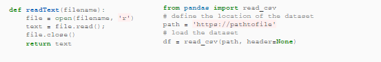
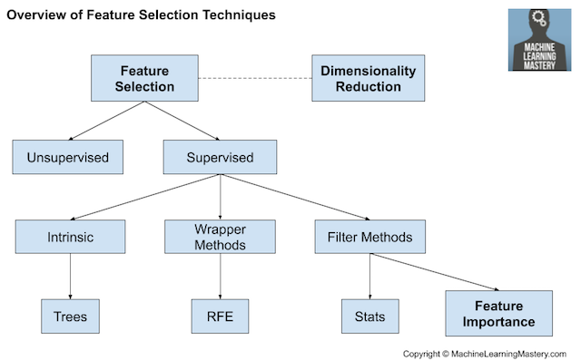

Foundations of Machine Learning 
==================================

Problem Statement
-------------------------

Problem Definition Framework
^^^^^^^^^^^^^^^^^^^^^^^^^^^^^

The first step in any project is defining your problem. You can use the most powerful and shiniest algorithms available, but the results will be meaningless 
if you are solving the wrong problem.

**What is the problem?** 

Describe the problem informally and formally and list assumptions and similar problems.

**Why does the problem need to be solve?**
 
List your motivation for solving the problem, the benefits a solution provides and how the solution will be used.

**How to solve the problem?**

Describe how the problem would be solved manually to flush domain knowledge.

Data Preparation 
-----------------

Gathering Data 
^^^^^^^^^^^^^^^^

The first step in data preparation is finding an already available dataset that matches your problem statement. Fortunately, there are thousands:

**- Popular open data repositories:**

       UC Irvine Machine Learning Repository
    
       Kaggle datasets

       Amazon’s AWS datasets

**- Meta portals** (they list open data repositories):

        Data Portals

        Open DataMonitor

        Quandl

- Other pages listing many popular open data repositories:

        Wikipedia’s list of Machine Learning datasets

        Quora.com

        The datasets subreddit

Loading Data 
^^^^^^^^^^^^^

Either download the chosen datasets or get a url if the dataset is too large.

Load the data into your program using Pandas or using the standard file system in Python.

Data Cleaning 
^^^^^^^^^^^^^^

**Data cleaning** involves fixing systematic problems or errors in “messy” data.

There are many reasons data may have incorrect values, such as being *mistyped, corrupted, duplicated, and so on*. Domain expertise may allow obviously erroneous observations to be identified as they are different from what is expected, such as **a person’s height of 200 feet**.

The most useful data cleaning involves deep domain expertise and could involve identifying and addressing specific observations that may be incorrect.

Once messy, noisy, corrupt, or erroneous observations are identified, they can be addressed. This might involve removing a row or a column. Alternately, it might involve replacing observations with new values.

Data Cleaning Techniques
^^^^^^^^^^^^^^^^^^^^^^^^^

There are general data cleaning operations that can be performed, such as:

        - Using statistics to define normal data and identify **outliers**.
        - Identifying columns that have the same value or no variance and removing them.
        - Identifying **duplicate** rows of data and removing them.
        - Marking **empty** values as missing.
        - Imputing **missing** values using statistics or a learned model.

Feature Selection
^^^^^^^^^^^^^^^^^^^

**Feature selection** refers to techniques for selecting a subset of input features that are most relevant to the target variable that is being predicted.

This is important as *irrelevant* and *redundant* input variables can distract or mislead learning algorithms possibly resulting in lower predictive performance. 

Additionally, it is desirable to develop models only using the data that is required to make a prediction, e.g. to favor the simplest possible well performing model.

Feature Selection Techniques
^^^^^^^^^^^^^^^^^^^^^^^^^^^^^^^^

Feature selection techniques are generally grouped into those that use the target variable **(supervised)** and those that do not **(unsupervised)**. 

Additionally, the supervised techniques can be further divided into models that automatically select features as part of fitting the model **(intrinsic)**, those that explicitly choose features that result in the best performing model **(wrapper)** and those that score each input feature and allow a subset to be selected **(filter)**.

There are different common feature selection use cases we may encounter in a predictive modeling project, such as:

        -**Categorical** inputs for a **classification** target variable.

        -**Numerical** inputs for a **classification** target variable.

        -**Numerical** inputs for a **regression** target variable.

  

