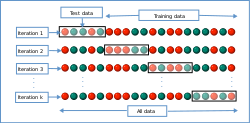
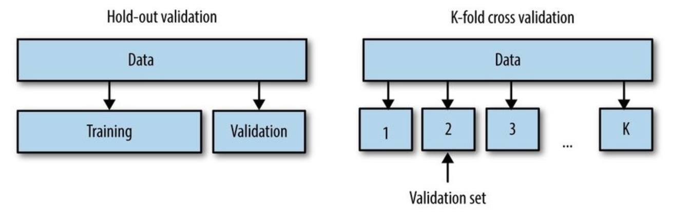
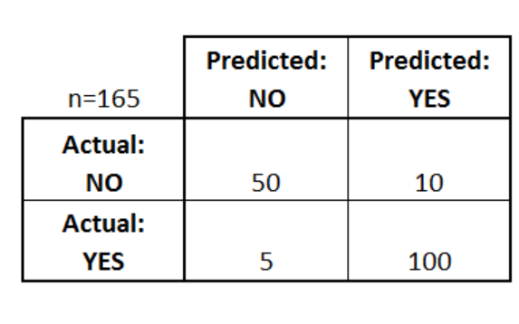

Foundations of Machine Learning 
==================================

Problem Statement
-------------------------

Problem Definition Framework
^^^^^^^^^^^^^^^^^^^^^^^^^^^^^

The first step in any project is defining your problem. You can use the most powerful and shiniest algorithms available, but the results will be meaningless 
if you are solving the wrong problem.

**What is the problem?** 

Describe the problem informally and formally and list assumptions and similar problems.

**Why does the problem need to be solve?**
 
List your motivation for solving the problem, the benefits a solution provides and how the solution will be used.

**How to solve the problem?**

Describe how the problem would be solved manually to flush domain knowledge.

Data Preparation 
-----------------

Gathering Data 
^^^^^^^^^^^^^^^^

The first step in data preparation is finding an already available dataset that matches your problem statement. Fortunately, there are thousands:

- **Popular open data repositories:**

       UC Irvine Machine Learning Repository
    
       Kaggle datasets

       Amazon’s AWS datasets

- **Meta portals** (they list open data repositories):

        Data Portals

        Open DataMonitor

        Quandl

- Other pages listing many popular open data repositories:

        Wikipedia’s list of Machine Learning datasets

        Quora.com

        The datasets subreddit

Loading Data 
^^^^^^^^^^^^^

Either download the chosen datasets or get a url if the dataset is too large.

Load the data into your program using Pandas or using the standard file system in Python.

.. image:: Images/02_01.png
  :width: 600
  :alt: loading data
  :align: center
  :target: https://docs.google.com/presentation/d/1xvGqSqDUIucmty79nNWx_TkrCAUPgiHpExrstP9IO74/edit#slide=id.gbf3297c68b_0_4

Data Cleaning 
^^^^^^^^^^^^^^

**Data cleaning** involves fixing systematic problems or errors in “messy” data.

There are many reasons data may have incorrect values, such as being *mistyped, corrupted, duplicated, and so on*. Domain expertise may allow obviously erroneous observations to be identified as they are different from what is expected, such as **a person’s height of 200 feet**.

The most useful data cleaning involves deep domain expertise and could involve identifying and addressing specific observations that may be incorrect.

Once messy, noisy, corrupt, or erroneous observations are identified, they can be addressed. This might involve removing a row or a column. Alternately, it might involve replacing observations with new values.

Data Cleaning Techniques
^^^^^^^^^^^^^^^^^^^^^^^^^

There are general data cleaning operations that can be performed, such as:

        - Using statistics to define normal data and identify **outliers**.
        - Identifying columns that have the same value or no variance and removing them.
        - Identifying **duplicate** rows of data and removing them.
        - Marking **empty** values as missing.
        - Imputing **missing** values using statistics or a learned model.

Feature Selection
^^^^^^^^^^^^^^^^^^^

**Feature selection** refers to techniques for selecting a subset of input features that are most relevant to the target variable that is being predicted.

This is important as *irrelevant* and *redundant* input variables can distract or mislead learning algorithms possibly resulting in lower predictive performance. 

Additionally, it is desirable to develop models only using the data that is required to make a prediction, e.g. to favor the simplest possible well performing model.

Feature Selection Techniques
^^^^^^^^^^^^^^^^^^^^^^^^^^^^^^^^

Feature selection techniques are generally grouped into those that use the target variable **(supervised)** and those that do not **(unsupervised)**. 

Additionally, the supervised techniques can be further divided into models that automatically select features as part of fitting the model **(intrinsic)**, those that explicitly choose features that result in the best performing model **(wrapper)** and those that score each input feature and allow a subset to be selected **(filter)**.

There are different common feature selection use cases we may encounter in a predictive modeling project, such as:

        - **Categorical** inputs for a **classification** target variable.

        - **Numerical** inputs for a **classification** target variable.

        - **Numerical** inputs for a **regression** target variable.

.. image:: Images/02_02.png
  :width: 600
  :alt: Feature Felection
  :align: center
  :target: https://machinelearningmastery.com/feature-selection-with-real-and-categorical-data/

  
Data Transformation
^^^^^^^^^^^^^^^^^^^^
**Data transforms** are used to change the type or distribution of data variables.This is a large umbrella of different techniques and they may be just as easily applied to input and output variables.

        - **Numeric Data Type:** Number values.

                - **Integer:** Integers with no fractional part.
                
                - **Real:** Floating point values.

        - **Categorical Data Type:** Label values.

                - **Ordinal:** Labels with a rank ordering.

                - **Nominal:** Labels with no rank ordering.

                - **Boolean:** Values True and False.

Data Transformation Techniques
^^^^^^^^^^^^^^^^^^^^^^^^^^^^^^^

There are a few common techniques to transform data:

        - *Discretization Transform:* Encode a numeric variable as an ordinal variable.

        - *Ordinal Transform:* Encode a categorical variable into an integer variable.

        - *One-Hot Transform:* Encode a categorical variable into binary variables.

        - *Normalization Transform:* Scale a variable to the range 0 and 1.

        - *Standardization Transform:* Scale a variable to a standard Gaussian.

Data Transformation
^^^^^^^^^^^^^^^^^^^^^^
**Data transforms** are used to change the type or distribution of data variables.This is a large umbrella of different techniques and they may be just as easily applied to input and output variables.
        - **Numeric Data Type:** Number values.
                - *Integer:* Integers with no fractional part.
                - *Real:* Floating point values.
        - **Categorical Data Type:** Label values.
                - *Ordinal:* Labels with a rank ordering.
                - *Nominal:* Labels with no rank ordering.
                - *Boolean:* Values True and False.

Feature Engineering
^^^^^^^^^^^^^^^^^^^^^^^^^
**Feature engineering** refers to the process of creating new input variables from the available data.

Engineering new features is highly specific to your data and data types.This specialization makes it a challenging topic to generalize to general methods.Nevertheless, there are some techniques that can be reused, such as:

        - Adding a **boolean flag** variable for some state.
        - Adding a group or global summary statistic, such as a **mean**.
        - Adding **new variables** for each component of a compound variable, such as a date-time.
        - **Polynomial Transform:** Create copies of numerical input variables that are raised to a power.

Model Selection
-------------------

Introduction
^^^^^^^^^^^^^^^

Given easy-to-use machine learning libraries like scikit-learn and Keras, it is straightforward to fit many different machine learning models on a given predictive modeling dataset.

So the challenge of applied machine learning, becomes how to choose among a range of different models that you can use for your problem.

Naively, you might believe that performance is sufficient, but you should consider other concerns, such as **how long** the model takes to train or **how easy** it is to explain to others, and **how robust** you model is for other applications.

Defining Model Selection 
^^^^^^^^^^^^^^^^^^^^^^^^^^^

**Model selection** is the process of selecting one final machine learning model from among a collection of candidate machine learning models for a training dataset.

Model selection is a process that can be applied both across different types of models (e.g. logistic regression, SVM, KNN, etc.) and across models of the same type configured with different model hyperparameters (e.g. different number of epochs for a CNN).

**Model selection** is the process of choosing one of the models as the final model that addresses the problem.

Consideration
^^^^^^^^^^^^^^^

Things to consider when selecting a model:

        - A model that meets the requirements and constraints of the project.
        - A model that is sufficiently skillful given the time and resources available.
        - A model that is skillful as compared to naive models.
        - A model that is skillful relative to other tested models.
        - A model that is skillful relative to the state-of-the-art.

Model Selection Techniques
^^^^^^^^^^^^^^^^^^^^^^^^^^^^

The best approach to model selection requires “sufficient” data, which may be nearly infinite depending on the complexity of the problem.

In this ideal situation, we would split the data into training, validation, and test sets, then **fit** candidate models on the training set, **evaluate** and select them on the validation set, and **report** the performance of the final model on the test set.

This is impractical on most predictive modeling problems given that we rarely have sufficient data, or are able to even judge what would be sufficient.

Model Selection Techniques
^^^^^^^^^^^^^^^^^^^^^^^^^^^^

Instead, there are two main classes of techniques to approximate the ideal case of model selection:

        - **Probabilistic Measures:** Choose a model via in-sample error and complexity.

        - **Resampling Methods:** Choose a model via estimated out-of-sample error.

Probabilistic Measures
^^^^^^^^^^^^^^^^^^^^^^^

**Probabilistic measures** involve analytically scoring a candidate model using both its performance on the training dataset and the complexity of the model.

It is known that training error is optimistically biased, and therefore is not a good basis for choosing a model. The performance can be penalized based on how optimistic the training error is believed to be. This is typically achieved using algorithm-specific methods, often linear, that penalize the score based on the complexity of the model.

A model with fewer parameters is less complex, and because of this, is preferred because it is likely to generalize better on average.

Resampling Methods
^^^^^^^^^^^^^^^^^^^

**Resampling methods** seek to estimate the performance of a model (or more precisely, the model development process) on out-of-sample data.

This is achieved by splitting the training dataset into sub train and test sets, fitting a model on the sub train set, and evaluating it on the test set. This process may then be repeated multiple times and the mean performance across each trial is reported.

Three common resampling model selection methods include:
        - Random train/test splits.
         - Bootstrap.
        - Cross-Validation (k-fold)
       

Model Evaluation 
-----------------

Model Evaluation
^^^^^^^^^^^^^^^^^^

**Model evaluation** aims to estimate the generalization accuracy of a model on future test data.

Methods for evaluating a model’s performance are divided into 2 categories: holdout and Cross-validation. Both methods use a validation set (i.e data not seen by the model) to evaluate model performance.

It’s not recommended to use the data we used to build the model to evaluate it. This is because our model will simply remember the whole training set, and will therefore always predict the correct label for any point in the training set.

Holdout vs k-fold
^^^^^^^^^^^^^^^^^^^

Performance Metrics
^^^^^^^^^^^^^^^^^^^^^^

**Performance Metrics** are probabilistic measures of the model that you can calculate to determining how “good” your current model is. Common performance metrics are:

                - Classification Accuracy

                - Sensitivity/Specificity

                - Area Under Curve

                - Precision/Recall
                
                - F1 Score

The Confusion Matrix
^^^^^^^^^^^^^^^^^^^^^

                - True Positives : The cases in which we predicted YES and the actual output was also YES.

                - True Negatives : The cases in which we predicted NO and the actual output was NO.
                
                - False Positives : The cases in which we predicted YES and the actual output was NO.

                - False Negatives : The cases in which we predicted NO and the actual output was YES.

Classification Accuracy

