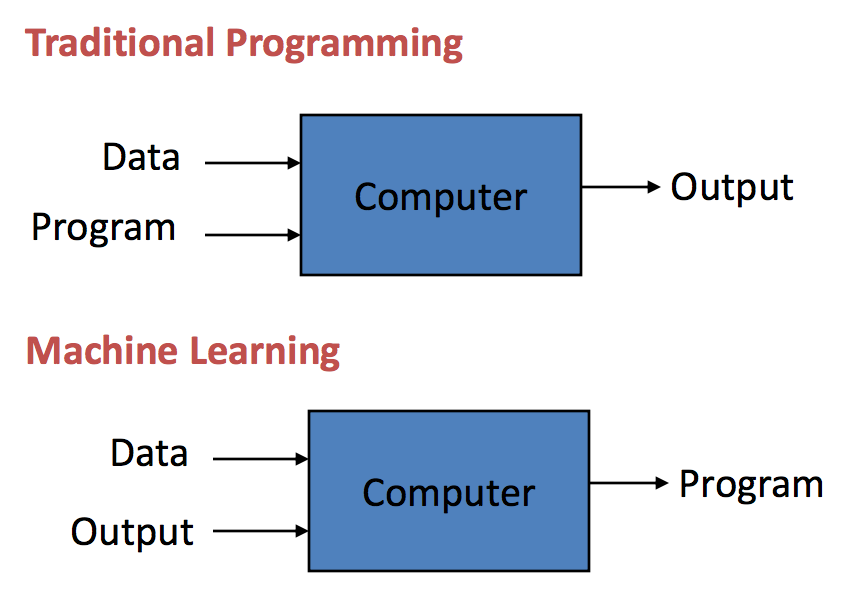

Introduction to Machine Learning
==================================

Defining Machine Learning
-------------------------

**Machine Learning** utilizes mathematics, statistics, and computer science to shape and analyze data as to make predictions and/or decisions.

*Traditional programming* has explicit methods that are manually created to produce output whereas *machine learning* is where the computer learns its own methods based on input and output data.

*“Machine Learning is the field of study that gives computers the ability to learn without being explicitly programmed.”*
- Arthur Samuel, 1959
